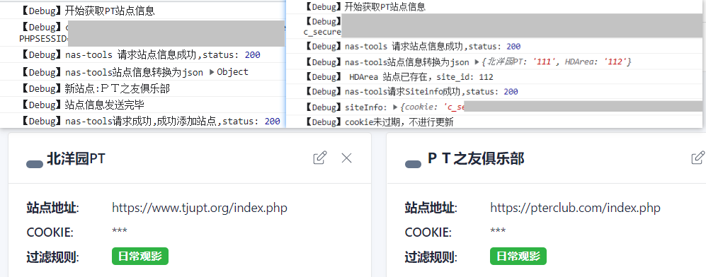

github：https://github.com/Eao-Kind/Self--use-tool/blob/main/ptSiteToNas-tools/PtSiteToNas-tools.js

**重要说明**

​	强烈建议nas-tools版本最好>=2.0.3 且 9月1号之后**更新**过容器。【**可保留rssurl、自定义的站点名称等等所有信息**】

​	使用脚本更新站点cookie信息到nastools时，默认使用过滤规则为：日常观影，rss链接默认为空，优先级为 2。

​	使用油猴BETA版可获取到更多站点的cookie，基础版无法获取到MT、U2的cookie(目前已知)

​	注意，浏览器中站点的标签大部分需要符合以index.php为结尾，否则不能成功发送获取站点信息。如下：

>  http://hdhome.org/index.php

​	更多网站请查看脚本中的 @match ，目前仅有20站，大家多多反馈缺少的站点呀。

# 使用步骤

**油猴添加脚本**

https://greasyfork.org/zh-CN/scripts/450509-ptsitetonas-tools

**访问nas-tools的web**

浏览器访问nas-tools，确保可以成功访问。

```
# 然后修改脚本中的url地址
let nanstoolurl = "http://ip:300"; // 请设置nas-tools的访问地址，如http://192.168.1.2:300
# 获取nas-tools的安全密钥，基础设置-安全-API密钥，填入token中
var token = "L4eYq9tfPZ3CsEaM";
// 如果油猴插件是测试版，请填写BETA,否则置空或改成其他任意字符
var tampermonkeyVersion = "BETA"; //
```


**开启脚本**


开启脚本之后，在浏览器中一次性打开所有站点标签，即可发送站点信息至nas-tools。可打开F12控制台查看脚本运行信息。


**效果展示**

使用完毕后可关闭脚本。


