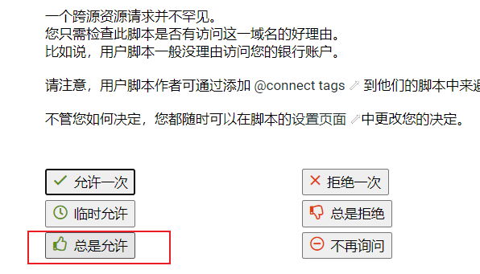

github：https://github.com/Eao-Kind/Self--use-tool/blob/main/ptSiteToNas-tools/PtSiteToNas-tools.js

**重要说明**

​	nas-tools版本需 >= 2.0.3

​	默认使用过滤规则为：日常观影，rss链接默认为空，优先级为 2。默认站点用途：签到、订阅、不刷流

​	使用油猴BETA版可获取到更多站点的cookie，否则很有可能获得的cookie无法进行搜索。

​	注意，浏览器中站点的标签大部分需要符合以index.php为结尾。如：

>  http://xxx.org/index.php

否则不能获取站点cookie信息。

## 使用步骤

**添加油猴脚本**

https://greasyfork.org/zh-CN/scripts/450509-ptsitetonas-tools

**访问nas-tools的web**

浏览器访问nas-tools，确保可以成功访问。然后按需修改自定义功能。

```
// 设置nas-tools的访问地址，如http://192.168.1.2:300
let nastoolurl = "http://192.168.1.204:300";
// 获取nas-tools的安全密钥，基础设置-安全-API密钥
var token = "L4eYq9tfPZ3CsEaM";
// 如果油猴插件是测试版(可获取更多cookie)，请填写BETA
var tampermonkeyVersion = "B___";
// 自定义配置：解析rss，日常观影，不通知，每日签到
var my_site_note = "Y|1000|N|Y";
// 自定义配置：默认优先级为"2"
var my_site_pri = "2"
// 自定义配置：签到Q、订阅D、刷流S，默认不刷流
var my_site_include = "QD"
```


**开启脚本**




开启脚本之后，在浏览器中一次性打开所有站点标签，即可发送站点信息至nas-tools。可打开F12控制台查看脚本运行信息。


